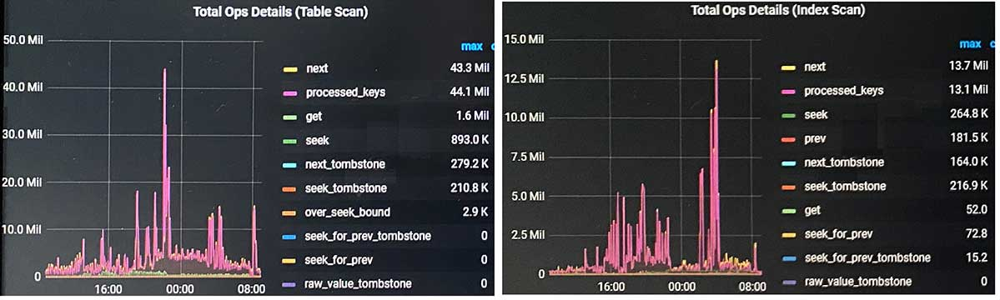
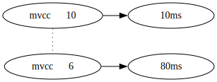

#

```
监控界面tikv-details>
    Coprocessor Detail>
        Total Ops Details（index scan)
next 的次数和 processed_key 的次数对比，
processed_key 代表读到的有效 key
```


next和processed_key差不多, 说明mvcc数据不多。

表中mvcc数据的多少, 受以下一些因素影响:
-   保留时限的参数, tidb_gc_life_time, 生产中可能保留6h~24h
-   数据修改量, 和业务相关
-   GC回收机制, Compaction Filter机制


上面一些概念, 在oracle undo中也有, 如undo_retention之类。

mvcc数量多时, 会影响到读表的性能, 一些简单的distsql索引读, 如果mvcc保留时间长、数量多时, 对查询性能的影响较大:


## 相关链接

[sql优化->...->指标-keys](../../../4SQL与优化/1执行计划/2plan及info解读/指标-keys.md)


