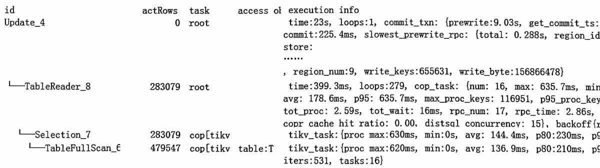
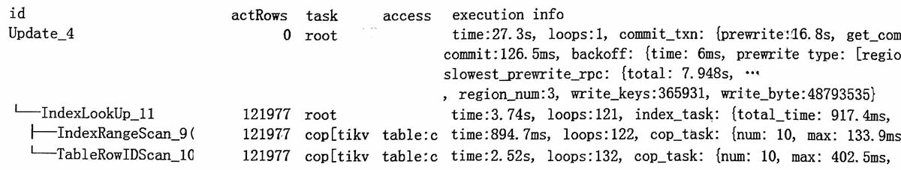
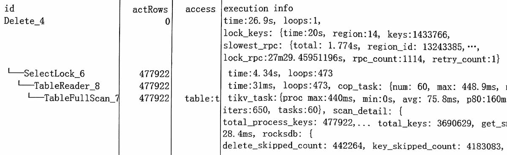

#

## update例1
update语句, 修改了283079行, 乐观事务, 自动提交  



```sql
-- 类似语句
update T
set t.col1 = replace(substr(t.col1, 1, char_length(t.coln)),...),
    t.col2 = replace(substr(...))
    ...
where
    t.batch_id = 'xxx'
```
update从开始到结束, 慢日志显示用了32.5s。  
-   那么推算 update中显示的time 23s, 仅是prepare数据部分;
-   commit用时9s多, 主要是kv多, 如果kv少则用时少于1秒;
-   全部用时 32s = 23s + 9s;

全表扫描用了399ms, 到提交之前, 一共用了23s, 去了哪里?  
>本例中sql语句比较复杂, set中有很多函数运算。

其它复杂的运算如 (where t1.col1 `regexp` t2.col2)这类, 运算十万次, 估计也要花十几秒。  

另一个update乐观自动提交, 总时长44s, 主要是慢在 slowest rpc 7.9s。  


## insert例2
悲观insert, 上锁, 


## delete例3
delete from t; -- 全表删除, 悲观事务, 上锁   
sql耗费的自然时间是43s。 有不少mvcc历史版本的数据, skip了418万。  


## 总结
DML语句从执行到提交完成的用时, 主要有以下几部分:
-   sql查询数据
-   sql加工数据 (有无复杂计算)
-   悲观事务的上锁用时 (kv多不多)
-   乐观事务在prewrite阶段的用时 (kv多不多)
-   写到tikv (比如插入语句的`{insert:41.9s}`?)

查询数据 + 加工数据 + 写到tikv, 在insert中统称为prepare阶段用时, 在update中没说, 估计也差不多。
>insert的prepare阶段, 不是JDBC API里的PrepareStmt()的prepare概念。


