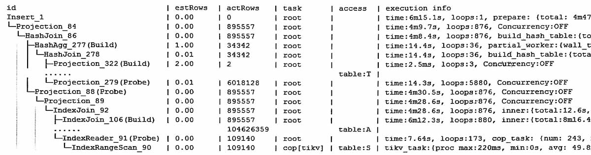
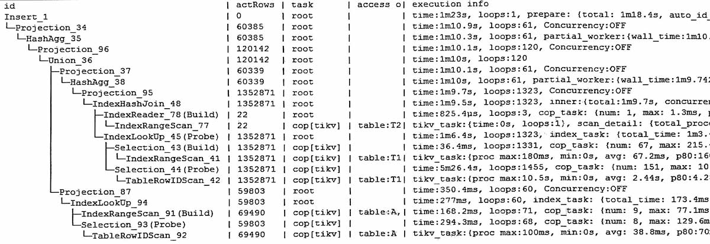
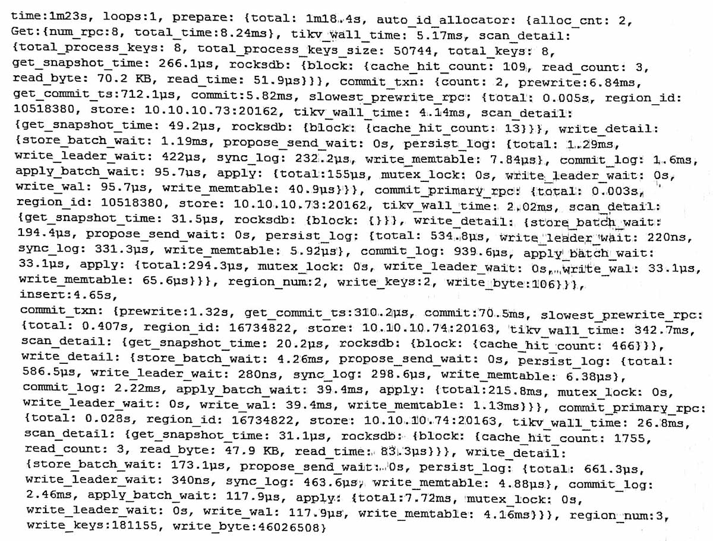

#

insert语句插入了 895557条, 表上有自增列  
insert into T select ... from S where ...  

执行计划  


T表特性:
-   非分区, 非聚簇, 主键bigint auto_increment  
-   60个字段, 一个普通索引,   
-   平均行长500字节, 白天看一般几十万行, 200M大小  
-   50多个region(含索引), 正常200M应该就几个region  
-   可能是跑批时表膨胀得比较大, 有几百万条, 所以region多。  

## 用时主干部分
```
time: 6m15.1s
prepare: 4m47.6s,
  auto_id_allocator: 112ms
    scan_detail: {num_rpc:108, keys:108}
    commit_txn
      count:27, region_num:27, write_keys:27
      prewrite:294ms, 
      commit:85ms
insert:1m27.5s,
commit_txn:
  prewrite:29.2s,
  commit:709.8ms,
  slowest_prewrite_rpc: 0.505s
  commit_primary_rpc: 19ms
  region num:27, write_keys:2686671
```

从用时看, 好象 time = prepare + insert  
commit用了30s, 不知道算在哪里  

插一行记录, 记录的KV数 = (表 + 一个主键 + 一个索引) = 3  
总KV数量 = 895557 * 3 = 2686671  


## 各部分

<details>
<summary>prepare部分</summary>
<div>
```
prepare: 
    total: 4m47.6s,
    auto_id_allocator: {
        alloc_cnt:27,
        Get: {num_rpc:108, total_time:159.8ms}, 
        total_process_time: 29ms, 
        total_wait_time: 34ms, 
        tikv_wall_time: 112.9ms, 
        scan_detail: {
            total_process_keys: 108,
            total_process_keys_size: 812560, 
            total_keys: 108
            get_snapshot_time: 42.9ms, 
            rocksdb: {
                block: {
                    cache_hit_count: 1448, 
                    read count: 5,
                    read byte: 193.9 KB, 
                    read time: 149.8μs
                }
            }
        },
        commit_txn: {
            count: 27,
            prewrite:294.1ms,
            get_commit_ts:26.3ms, 
            commit:85ms,
            slowest_prewrite_rpc: {
                total: 0.134s,
                region_id: 10518380,
                store: 10.10.10.73:20162, 
                tikv_wall_time: 133ms, 
                scan_detail: {
                    get_snapshot_time: 24.9μs, 
                    rocksdb: {
                        block: {cache_hit_count: 15}
                    }
                },
                write_detail: {
                    store_batch_wait: 28.5μs, 
                    propose_send wait: 0s, 
                    persist_log: {
                        total: 203.2μS
                        write_leader_wait: 240ns, 
                        sync_log: 126.9μs,
                        write_memtable: 10.1μs
                    },
                    Commit_log: 517.1us,
                    apply_batch_wait: 31.9us,
                    apply: {
                        total:131.8ms,
                        mutex_lock: 0s,
                        write_leader_wait: 131.5ms, 
                        write wal: 31.9μs,
                        write_memtable: 140.4μs
                    }
                }
            },
            commit_primary_rpc: {
                total: 0.034s,
                region id: 10518380, 
                store: 10.10.10.73:20162, 
                tikv_wall_time: 33.3ms, 
                scan_detail: {
                    get_snapshot_time: 11.3ms, 
                    rocksdb: {block: {}}
                }, 
                write detail: {
                    store batch wait: 13.8μs, 
                    propose_send_wait: 0s,
                    persist_log: {
                        total: 250.3μs, 
                        write_leader_wait: 220ns, 
                        sync_log: 175.3us, 
                        write_memtable: 4.74μs
                    }, 
                    commit log: 676.1us, 
                    apply batch_wait: 29.7us,
                    apply: {
                        total:156.2μs, 
                        mutex_lock: 0s, 
                        write_leader_wait: 0s, 
                        write_wal: 29.7us, 
                        write_memtable: 35μs
                    }
                }
            },
            region_num:27, write_keys:27, write_byte:1416
        }
    }
},
```
</div></details>

<details>
<summary>insert和commit部分</summary>
<div>
```
insert:1m27.5s,
commit_txn: {
    prewrite:29.2s,
    get_commit_ts:1.27ms,
    commit:709.8ms,
    slowest_prewrite_rpc: {
        total: 0.505s, region_id:31851992, store: 10.10.10.73:20163, tikv_wall_time: 459.2ms,
        scan_detail: {get_snapshot_time: 17.8us, rocksdb: {block: {cache_hit_count: 12}}},
        write_detail: {
            store_batch_wait: 24.9ms, 
            propose_send_wait: 0s,
            persist_log: {
                total: 5.86ms, 
                write_leader_wait: 260ns, 
                sync_log: 1.68ms,
                write_memtable: 8μs
            },
            commit_log: 17.7ms, 
            apply_batch_wait: 59.3ms,
            apply: {
                total:284.4ms, 
                mutex_lock: os, 
                write_leader_wait: 0s, 
                write_wal: 59.3ms, 
                write_memtable: 887.8us
            }
        }
    },
    commit_primary_rpc: {
        total: 0.019s, 
        region_id: 37817083, 
        store: 10.10.10.73:20163, 
        tikv_wall_time: 18.7ms,
        scan_detail: {
            get_snapshot_time: 27.5us, 
            rocksdb: {
                block: 
                {
                    cache_hit_count: 1770,
                    read_count: 3, 
                    read byte: 47.9 KB, 
                    read time: 64.8μs
                }
            }
        },
        write detail: {
            store_batch_wait: 173.1us, 
            propose_send_wait: 0s,
            persist_log: {
                total:2.42ms, 
                write_leader_wait:320ns, 
                sync_log:2.2ms,
                write memtable: 5.3μs
            },
            commit_log: 3.45ms, 
            apply_batch_wait: 23.8us,
            apply: {
                total:4.4ms, 
                mutex_lock: 0s, 
                write_leader_wait: 0s, 
                write_wal: 23.8us,
                write_memtable: 2.28ms
            }
        }
    },
    region_num:27, write_keys:2686671, write_byte:826814562
}
```
</div></details>

## 另一个例子





