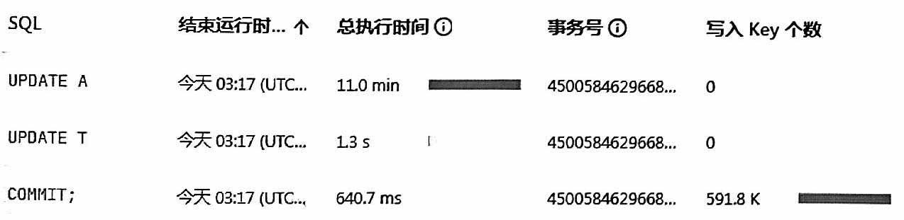
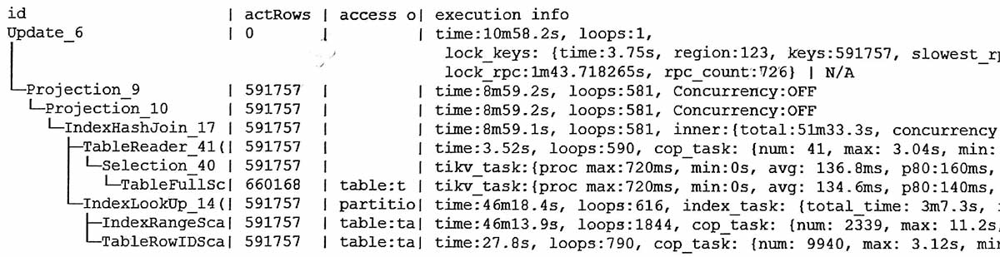
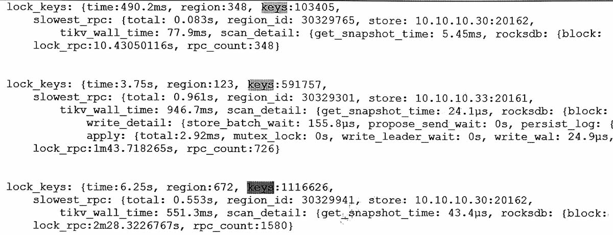

#

按事务号查询得到:    

#

## 说明

事务中有两个update(A改了59万, T改了0行), 最后commit  
-   commit用时640ms (prewrite 444ms, commit阶段 74ms), 快得不正常
-   lock_rpc 用时1m43s, 不可忽视

(猜测)一边查询一边上锁, 所以update全部用时不是简单的select用时加lock用时。

在select 到 update完成之间 (8m59s ~ 10m58s)用了2分钟, 猜测是:
-   lock_rpc 上锁用时
-   把事务修改kv操作记录在会话内存, 还有没有其它?

感觉用不了2分钟。另外这里Key是 591757, 说明update没有更新到索引列。 

事务提交时:
-   把会话内存中kv修改记录写到tikv memtable (后面由LSM机制管理)
-   写binlog
-   2pc提交, 修改write CF中几十万条的记录的lock信息

下面是 lock_rpc 在不同行数下的参考 (不一定是线性, 与tikv忙有关):  

