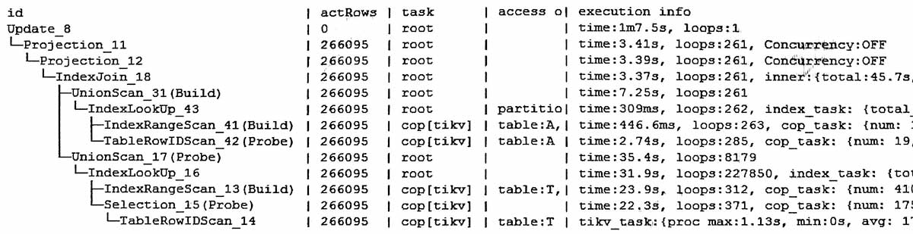

#
update语句, 修改了266095行  
update X inner join (...)  set x=...  

执行计划  


没有commit信息, 所以是后面手工提交的。没有上锁的信息, 有一种场景:
>是悲观事务, 但因为数据都是来自本事务内的insert, 不需要上锁, 或者说前面已经上过锁;

还有一个可能是乐观事务, 因此不需要上锁, 但好象不太可能, 因为没见过乐观事务手工提交, 一般乐观事务都是单条DML执行带自动提交绑在一起。


下面是观察到的一个悲观事务, 有些语句不需要上锁。  
```sql
delete from T;              -- 要上锁
insert into T select ...;   -- 要上锁
update T set ... where ...; -- 不需要上锁
commit;
```


