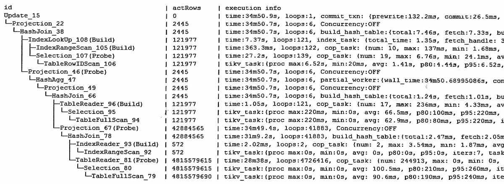

update语句, 修改了2445行  
update T inner join (...)  set x=...  

执行计划  

隐式事务, 自动提交, 修改条数2445行.   
在第一行update对应的信息中看到提交的用时
-   prewrite用了132ms, 
-   commit用了26ms

主要时间还是用在查询上
-   查询用了34分钟
-   其中一个48亿大表全表扫描用了28分钟

