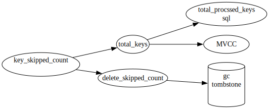

#




```
...
scan_detail: {total_process_keys: 5034, total_process_keys_size: 2899655, total_keys: 5626, rocksdb: {delete_skipped_count: 0, key_skipped_count: 6216, 
...
 ```


key_skipped_count 有时候会比total_keys小, 可能是统计问题。

如果MVCC版本很多, 则 total_processed_keys 远小于 total_keys或key_skipped_count, 是不好的现象。

下面例子, delete用时一秒多, 删除表记录几百条(算上索引有一千多kv)
```
total_process_keys:     1500
total_keys:             900000
delete_skipped_count:   5000
key_skipped_count:      2500000
```
可以看出, 因为扫描过的kv有200多万, 导致用时较多。

## 相关链接
[tikv实例->...->mvcc数量及影响因素](../../../2实例管理与优化/2TiKV实例/GC,合并,MVCC/mvcc数量及影响因素)

