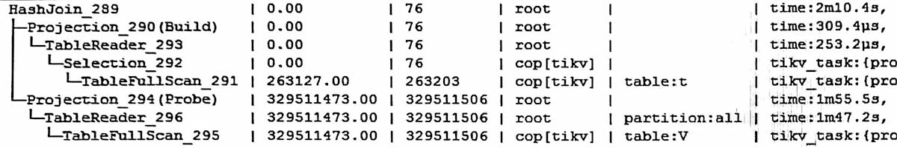

#

下面的例子比较容易看出每个部分的用时, 主要是probe端用了1m55s（墙上时钟)

下面的例子, 则看着比较头大, 每一步的用时好象都对不上。

比如probe端的S表的用时
-   上面plan显示的是4m46s(不是墙上时钟, 应该是5并发用时的总和)
-   下面Plan显示的是59s(如果是5并发用时总和, 则每并发12s也不象)

小结, 简单说indexjoin是个糊涂帐, 只能看最后总的用时, 中间部分用时只能看个大概。  
具体一点, 就是下面这些:  
>hashjoin子树的用时比indexjoin子树的用时直观;  
>indexjoin子树中各部分用时可能是纠缠在一起的;   
>indexjoin子树中probe端受build的端的影响;  
>cop[tikv]的用时要考虑 distsql并发度;  
>distsql并发也不是同时发起,可能是build端拿到一部分, 就查probe一部分;

