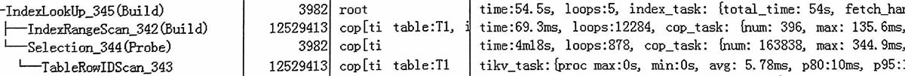
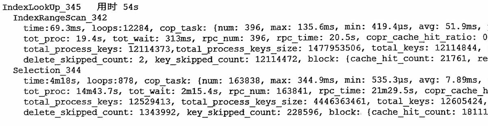

#



下面是更详细的信息


索引捞出1250万, 回到表中捞出1250万, 过滤后3982条。  
一共扫描了2500万, 主要是回表的cop任务多, 从而rpc_num和rpc_time较高 。  

cop_task数量较多, 它的来源大概是下面这样:
```sql
1250万表记录散落在表中几百个不同region上, 
build端按1000条分批次, 则有12500批次, 
每1000条可能平均涉及13个region, 
因此总共生成 cop_task = 12500*13=162500 -- 近似于图中 163838
这些cop_task发送到probe端捞取数据
```

小结
>1000万索引回表, 如果cop_task也较多, 可能时间在30s以上

