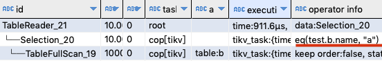
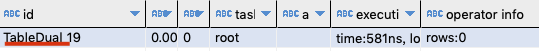
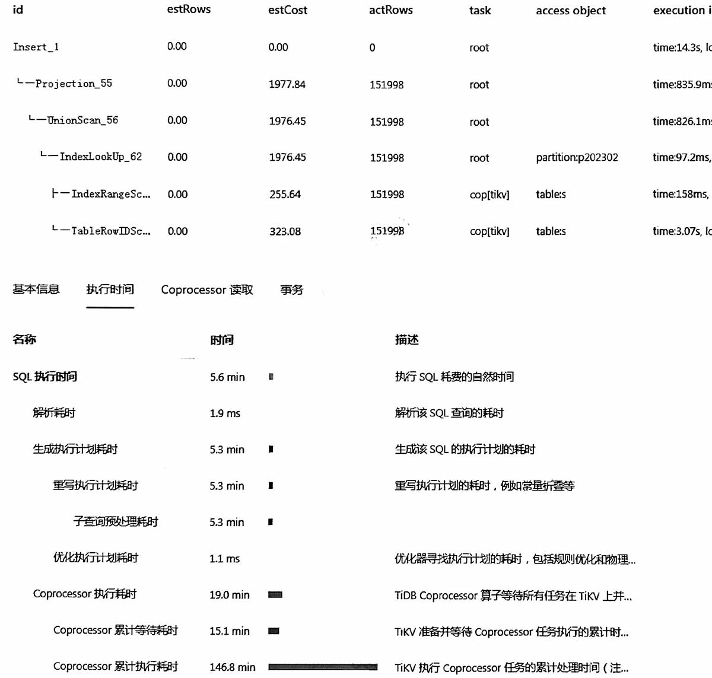

环境准备  
```sql
create table a (id int, name varchar(20));
create table b (id int, name varchar(20));
insert into a values(1, 'a');
```

下面提前计算了CTE的值, 所以where条件是name='a'
```sql
explain analyze
with tmp as (select name from a where id=1)
select * from b where name = (select name from tmp)
```


下面提前计算了CTE的值为null, 所以where name=null被简化为TableDual空表
```sql
explain analyze
with tmp as (select name from a where id=10) -- 不存在
select * from b where name = (select name from tmp)
```



## 如果子查询很慢
```sql
insert S
select ... from S
where 
dt = (select max(dt) from S)
and not exists(select 1 from S where dt='xxx')
```
如果S表很大, 计算子查询的时间长, 会出现以下现象, plan中才14s, 但整体时间5.6分钟:   



## 一个妙用

```sql
select part.* from part, T
where 
part.dt = T.dt
and part.id = T.id
```
分区表part按日期dt字段分区, id上有索引, 小表T中没几个日期。  
原始计划是 T hashjoin part(全分区扫描)

给sql加个冗余条件, 实现part的分区剪裁
```sql
select part.* from part, T
where 
part.dt = T.dt
and part.id = T.id
and part.dt <= (select max(dt) from T) -- max值会提前被计算出来作为常量
···


