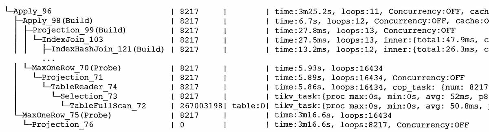

#
apply标量子查询的计划  


```sql
-- 模拟语句
select * from t
where
t.val = ifnull(
    (select val from D where ...),
    (select val from E where ...) )
```
解读:  
-   外表每一条记录, 都执行子查询一次(子查询可出现在sql中任何位置)
-   这里第一次apply, 时间从几十毫秒涨到6.7秒;
-   第二次apply, 时间从6.7秒, 涨到3分25秒, 用时以乘法递增;
-   D表只有32000条, 但循环8217次全表扫描后, 总读数是2.67亿;

## 说明
普通的标量子查询, 优化器会自动改为表关联, 比如下面这个:
```sql
select a.id,
  (select b.name from b where a.id = b.id) as name
from a
```

复杂的标量子查询, 比如带有case when的, 只能使用apply
```sql
select a.id,
  (case when a.id < 999 then substr((select name from b where a.id = b.id), 1, 10)
        when a.id < 9999 then (select name from b where a.id = b.id)
   else 'null' end) as name
from a
```

一般apply关联方式都会导致不优化的计划 `CARTESIAN left outer join`

## 优化apply

一般在外表的条数很多时, apply的代价大。  
优化的办法是看能否改成表关联。

## hashjoin转apply
如果外表小而内表大, 则hashjoin的代价大, 如果此时indexjoin不可用, 则可以考虑使用apply。  
在v6.5中, 对于子查询使用hint `NO_DECORRELATE`, 可以避免优化器把子查询展开为与外表关联的hashjoin, 而是使用apply。  
对v6.1以及下, 则不太好转。

asktug中有一个贴子说到如何处理hashjoin成apply  
https://asktug.com/t/topic/994770/14


