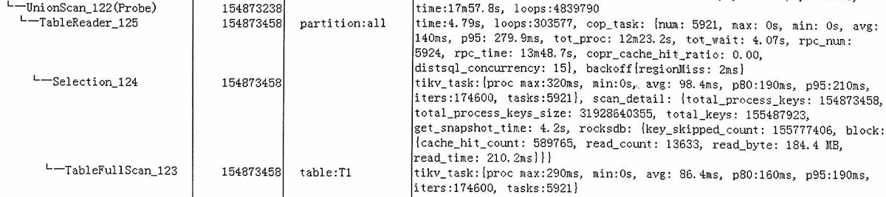

这里unionscan时间长, 也许是条数多?

好象这些事务kv, 都会存放在tidb memBuffer中?
@_@《tidb:基础知识》memBuffer

## union scan

https://cn.pingcap.com/blog/tidb-api-union-scan

如果我们把 INSERT, UPDATE, DELETE的修改操作，以 row 为单位记录下来，这样和下推 API 返回的结果就是同样的形式了，就可以很方便的做 Merge 的计算了。

所以 Union Scan 的算法就是以 Row 为单位，把事务的修改操作保存起来，最终和下推 API 返回的结果集进行 Merge，返回给客户端。

