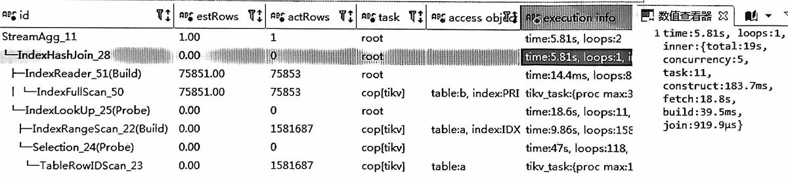
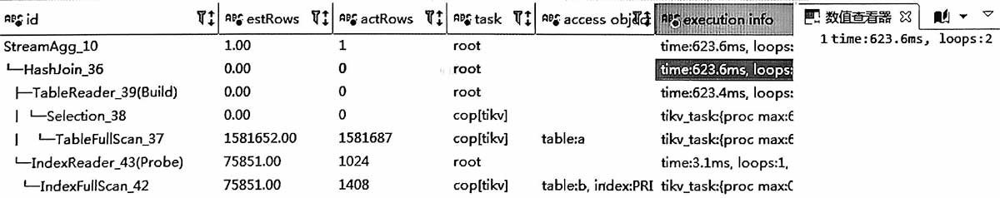

## 原执行计划


```sql
-- 语句类似于
select count(1) from a, b
where a.id = b.id
and a.state = '01'
```

### 分析
a表158万, b表7.5万, 原plan有几个特点
-   b表小, 所以是驱动表; 无过滤条件, 所以全索引扫描
-   b.id都在a表中, 所以id关联相当于a全表索引命中
-   a全表索引命中后, 还要回表读state值, 过滤后结果为0条

### 结论
IndexJoin的循环次数多, 且效果不好。

## 优化建议
既然a是全表命中, 所以 可以 a hashjoin b,  
理论上 b hashjoin a 也可以, 不过因为a经state过滤后为0, 所以放在前面  
```sql
-- 语句类似于
select /*+ hash_join(b)  */
count(1) from a, b
where a.id = b.id
and a.state = '01'
```

改完后，有以下几个特点
-   a全表扫描158万, 经state过滤后为0, 都发生在tikv层面, 很快
-   a和b是并行读取, 由于a的结果是0条, 因此b表的读取在半途就中止了, 只读取了1408条


