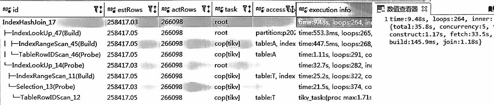
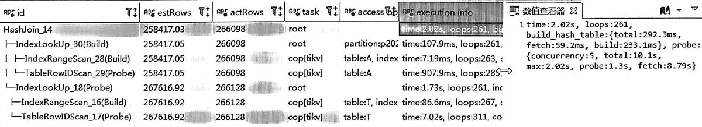

## 原执行计划


```sql
-- 语句类似于
select t.* from t, a
where a.id = t.id
and a.dt='2000-01-01'
and a.id='13908000001'
```
### 分析
a表id过滤后26万, t表id过滤后26万, a表id在t表中基本都有。  
原plan有几个特点:
-   走indexjoin, 理论上循环26万次

### 结论
IndexJoin外表循环多, 且效果不好。

## 优化建议
既然a表传给t表的id都能找到, 不如t表自己通过id过滤。 
```sql
-- 语句类似于
select /*+ hash_join(t)  */
 t.* from t, a
where a.id = t.id
and a.dt='2000-01-01'
and a.id='13908000001'
```

改完后，有以下几个特点
-   使用hashjoin, 这下a和t先各算各的, 然后再join就可以;


