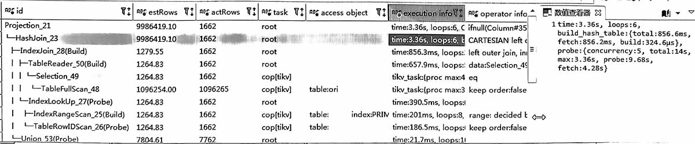
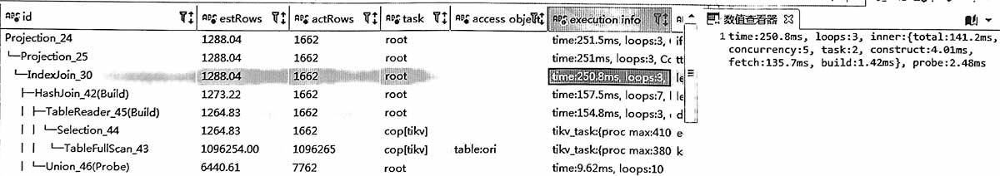

## 原执行计划


```sql
-- 语句类似于
select ori.id, ..., t2.name from ori
left join t2 on
   ori.id = t2.id
OR 
   ori.id = t2.sub_id
```

### 分析
每个ori.id需要和t2的多列(id, sub_id)做比较, 无法单键关联, 所以这是个笛卡尔积。  
tidb的plan是 `CARTESIAN left join`, 执行了3秒多。

### 结论
OR导致了笛卡尔积。

## 优化建议
把`OR`改为`UNION`子句, 
```sql
-- 语句类似于
select ori.id, ..., t2.name from ori
left join t2 on
   ori.id = t2.id
UNION
select ori.id, t2.name from ori
left join t2 on
   ori.id = t2.sub_id
```


改完后，消除了`CARTESIAN`, 上面是union前半句的plan, 只要250ms。


