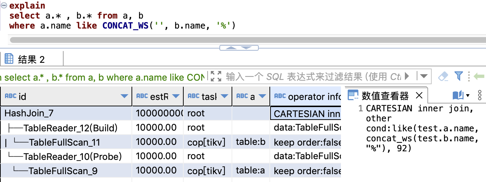

## 原执行计划
create table a(id int, name varchar(20), key idx_a_name(name));  
create table b(id int, name varchar(20), key idx_a_name(name));


### 分析
:::tip
IndexJoin的基本要求之一:  
-   两表关联的字段, 必须是等值计算`=`, 不能是`like`, `>`, `<` 等等。
-   内表关联字段上不能有函数, 外表可以有

比如想走 a indexjoin b, 且关联条件:
```
a.name = b.name                 # 可以, 最常见情况
substr(a.name, 1, 10) = b.name  # 可以
cast(a.name as bigint) = b.id   # 可以
cast(a.name as double) = cast(b.id as double) # 不可以
a.name > b.name                 # 不可以
```
不满足上述要求的表关联, 只能使用HashJoin。  
使用`like`, `>`, `<`, 则一般有 CARTESIAN笛卡尔积, 性能更差
:::

### 结论
两表关联, 使用了like, 不满足IndexJoin要求。

## 优化建议
改写关联条件为IndexJoin认可的方式。


