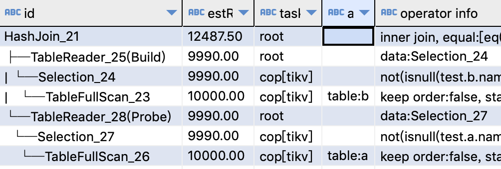

## 原执行计划
create table a(id int, name varchar(20));  
create table b(id int, name varchar(20));

explain select a.* , b.* from a, b
where a.name = b.name


### 分析
:::tip
IndexJoin的基本要求之二:  
-   内表关联字段上有索引,且是索引前缀
:::

如果强制指定hint
```sql
explain
select /*+ inl_join(b) */
a.* , b.* from a, b
where a.name = b.name
```
hint不生效, 有告警
>Optimizer Hint /*+ INL_JOIN(b) */ or /*+ TIDB_INLJ(b) */ is inapplicable

## 优化建议
内表字段上建索引。


