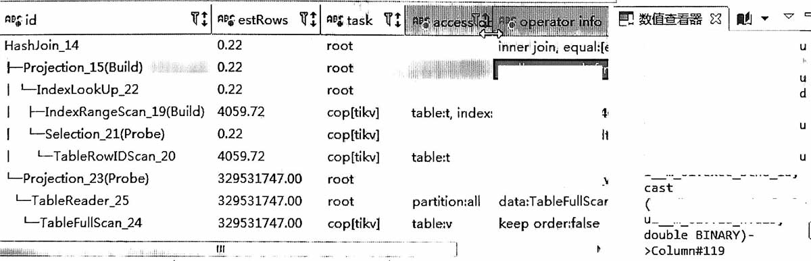
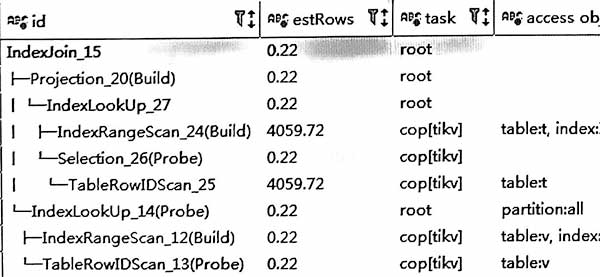

## 原执行计划


```sql
-- 语句类似如下, 其中t.val是varchar, v.id是bigint
select t.*, v.* from t, v
where t.val = v.id
and t.col='xxxx'
```
比较有意思的是, 优化器把t.val和v.id都做了转换
-   把t.val转成 double
-   把v.id也转成 double




### 分析
隐式转换后, 关联条件变为 `cast(t.val as double) = cast(v.id as double)`这样的函数计算, 不满足 IndexJoin的条件, 因此不走IndexJoin。

### 结论
隐式转换导致无法IndexJoin

## 优化建议
驱动表字段用cast转换, 被驱动表字段不变。

```sql
select t.*, v.* from t, v
where cast(t.val as unsigned bigint) = v.id
and t.col='xxxx'
```



改完后，可以走IndexJoin

