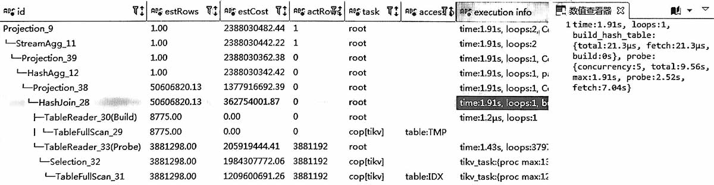
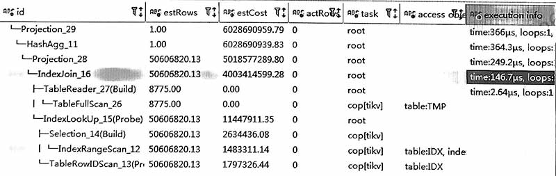

## 原执行计划


```sql
-- 语句类似于
select ...
from tmp left join idx
on  tmp.id = idx.id
  and tmp.col1 = idx.col1
  and tmp.col2 = idx.col2
group by tmp.id
```

### 分析
tmp表实际0条, idx表388万, 原plan有几个特点
-   tmp统计信息未更新, 还是老的8775;
-   优化器认为走 IndexJoin, 内表idx要读取5060万条(参见后面的计划), 所以最后选了HashJoin (cost低);

### 结论
这里的主要问题是高估了INL时内表idx要读取的条数。  
:::tip
两表之间用多个字段进行表关联时(如上面有 id, col1, col2), 更容易发生高估。  
防止优化器高估INL中内表的条数, 可以设置:  
>SET SESSION tidb_opt_fix_control = '44855:ON'
:::

## 优化建议
加hint, 走 tmp IndexJoin idx。
```sql
-- 语句类似于
select /*+ inl_join(idx) */
...
from tmp left join idx
on  tmp.id = idx.id
  and tmp.col1 = idx.col1
  and tmp.col2 = idx.col2
group by tmp.id
```

改完后，有以下几个特点
-   因为tmp返回0条, 所以不再访问idx表


## 参考信息
统计信息不准的可能原因:
-   小于1000条的小表不自动收集
-   没有机会自动收集, 因为自动收集任务被其它频繁更新的表所占用
