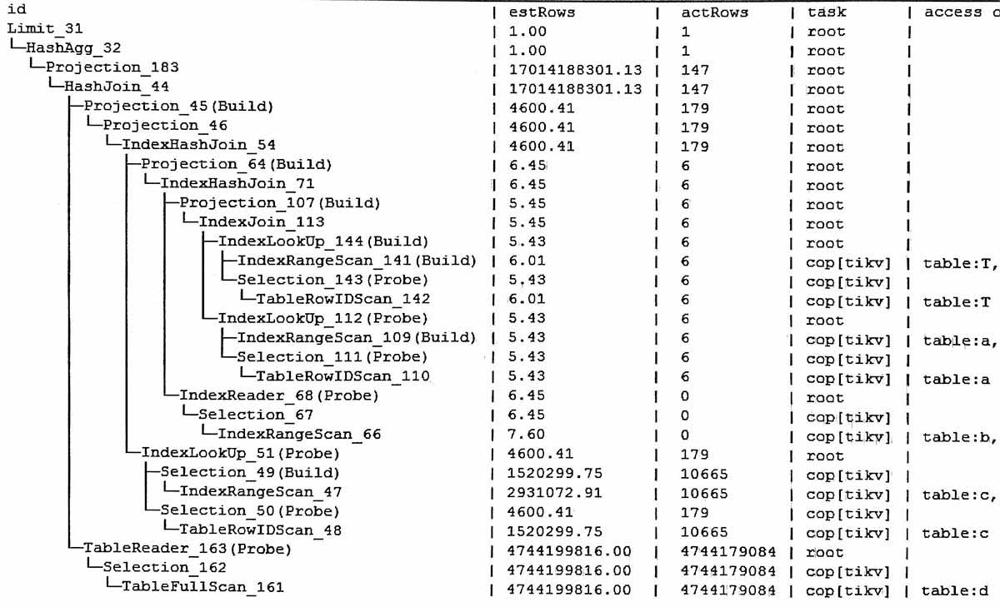
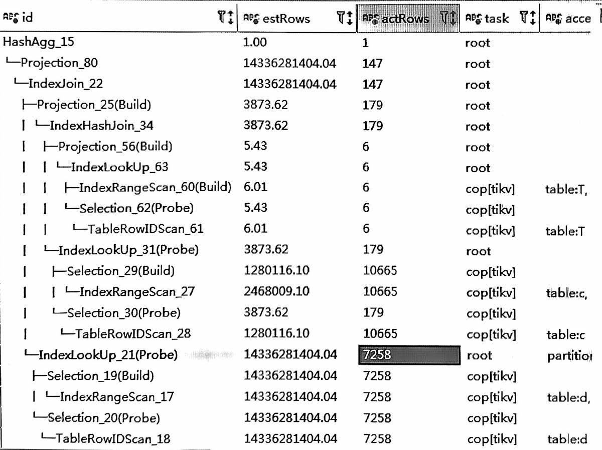

## 原执行计划

### 分析
原plan的信息
-   大表d走了全表扫描几十亿
-   优化器认为走 IndexJoin, 内表d要读取100多亿条(参见后面的计划), 所以最后选了HashJoin (cost低);

### 结论
优化高估了INL时内表d要读取的条数。  

## 优化建议
加hint, 走  IndexJoin d。

改完后，有以下几个特点
-   d表实际只要读取7258条

