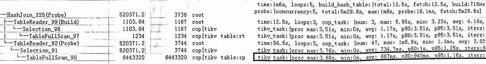

## 原执行计划

### 分析
rt表全表扫描1234条, 用了12秒,  
rp表全表扫描644万, 用了54秒。  
查看tikv_task, 有 `proc max:3.68s`, 即读一个region的最大用时, 很慢,  
因此怀疑当时tikv的性能有问题, 用grafana监控查看tikv的运行情况, 发现tikv的unified read pool cpu使用率很高。  

### 结论
可以确定是tikv的性能问题导致sql运行缓慢, 而非sql本身执行计划问题。

另外, 由于rt表比较小, 倒是可以考虑 rt IndexJoin rp。

