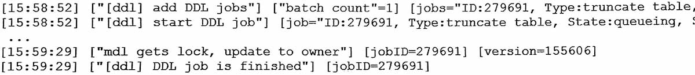
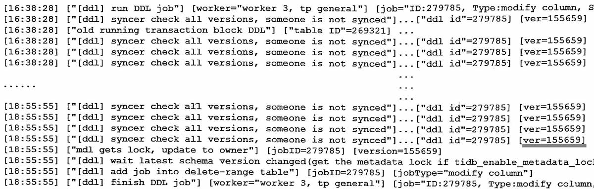

#

(1) 情况一  
truncate 遇到mdl锁, 即表上有其它事务。  
等表上事务结束, truncate获得mdl锁, 就执行成功。

(2) 情况二 schema version 相关  
一个或多个事务一直(或者交替)占着schema version (应该是region上的epoch_versoin), DDL只有等所有事务结束, 才可以改变version, 没有FIFO排列机制。下图中ver=155659保持了两个多小时, 也说明一直有事务占着。

## 分析
DDL被阻塞比较常见, 不过tidb的行为和oracle等其它软件不一样, 所以容易引起误解:
-   oracle下DDL遇到事务, 在nowait模式下会直接报错退出, tidb则是等待, 导致用户认为DDL已经开始真正执行了;
-   oracle下不少DDL会锁表锁事务, 用户不希望DDL跑的时间长;
-   tidb下比如add index跑了一天, 用户不知道是加索引时重组数据慢, 还是被阻塞了根本没有开始跑;

目前v6/v7没有简单判断ddl是否被阻塞的办法, 有时需要换用几个办法, 才可以确认DDL操作是被阻塞了:
-   查询视图 mysql.tidb_mdl_view, 这个比较慢, 可能要一分钟, 且有时候内容为空;
-   查询information_schema.cluster_tidb_trx的related_table_ids列, 看ddl的表是否在其中;
-   查询tidb.log, 看有没有提示old trx block ddl之类;

关于MDL和DDL的信息, 可以参考:  
[事务和锁->主锁副锁meta锁mdl锁](../../3事务和锁/6主锁副锁meta锁mdl锁.md)
