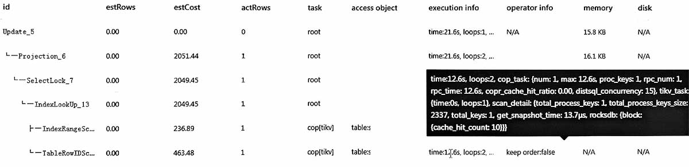
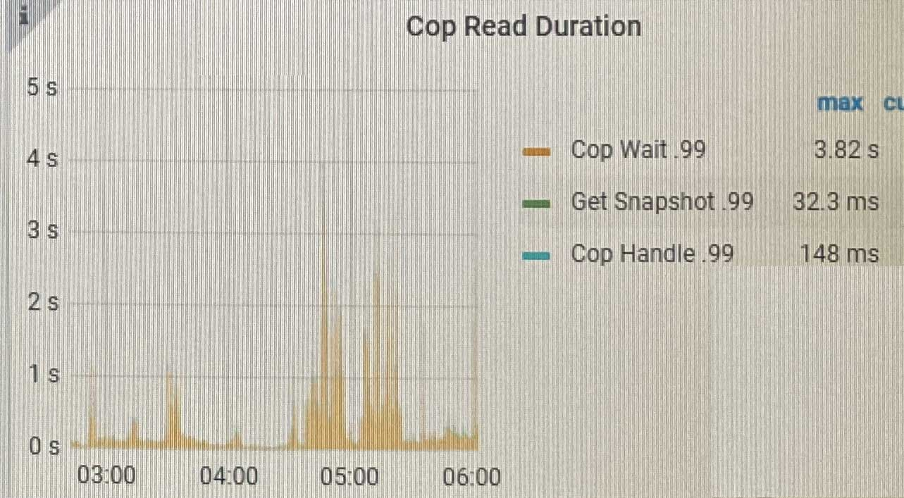
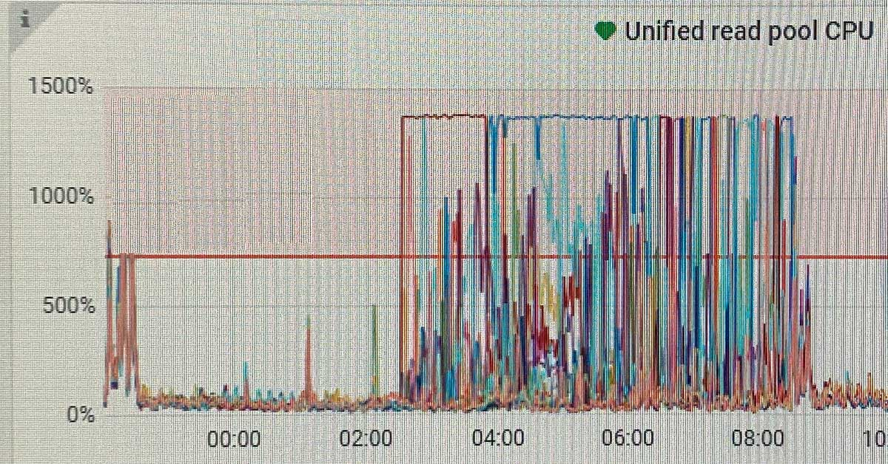
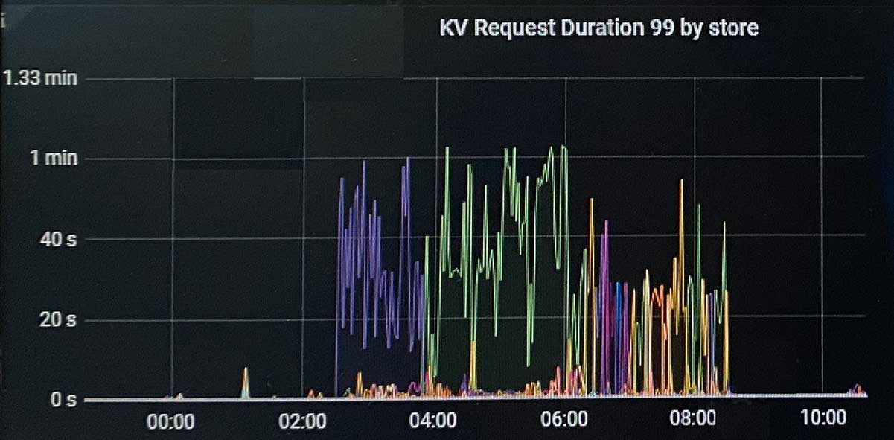

## 原执行计划

### 分析
sql计划中cop_task max有12s  
监控中cop wait经常超过1s  
tikv 统一读线程池 cpu 超过警戒线  
tidb的KV request在某些tikv上20s~40s

### 结论
tikv cpu忙导致coprocessor请求排队  
因此tidb的kv请求很慢

## 优化建议
tidb的kv请求只在某几个tikv上慢, 可能是某些sql热点把tikv节点cpu用完。

