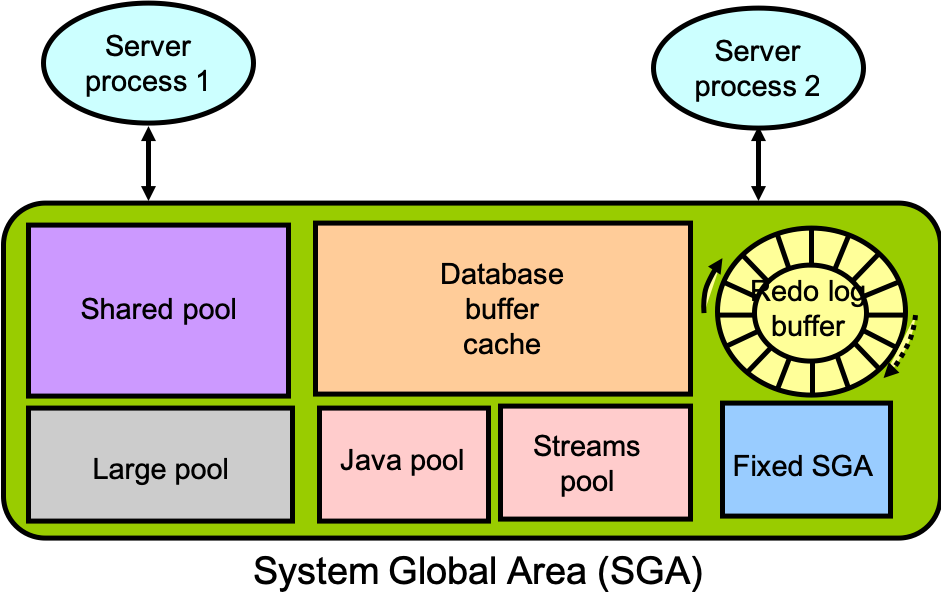

## oracle的实例结构图

## 问题的提出
有人问, "某个小sql在tidb中用时1秒, 而oracle用时不到1秒, 能不能优化一下"

查看sql的执行信息, 好象各个环节用时都挺正常的, 为什么比oracle慢呢?

## 分析
oracle老牌数据库, 对于一些小的查询和事务, 它在以下几个方面都做到了极致 (仅列几个突出的地方与tidb作对比):
-   解析sql时有plan缓存, shared pool可以减少硬解析, sql plan在各个会话之间共享
    *   tidb的plan cache, 目前(v6)用处不大, 基本都是硬解析
-   执行sql时有数据缓存, buffer cache可以减少对磁盘的IO访问, 数据块在会话之间共享
    *   tidb的copr-cache缓存, 目前用处不大, 各会话各读各的
-   增删改数据时, 只把修改的内容写到buffer cache, 不需要写到磁盘上(dbwr进程负责后台保存)
    *   tidb事务, 把修改的数据记在内存中, 这一步不慢
-   提交事务时, 只需要写`commit`这个操作到redo buffer中, 并flush到磁盘上, 就算提交完成, 也就是说只需要写几十个字节就可以, 非常轻量
    *   tidb事务要进行二阶段提交, 并把修改的数据全都写到tikv磁盘中, 才算commit完成

可见对于小sql(几十几百条数据量)的查询或修改:
-   oracle只要在shared pool中把计划取出来, 在buffer cache中搜索命中一下表和索引数据, 就跑完了;
-   而tidb则要经过硬解析、执行sql、到tikv上取数据等复杂过程, 有时候会比oracle慢;

tidb相比于oracle的优势, 是在其它方面, 这里暂且不提。对于小的数据库, 本来用oracle或mysql就挺好的, 没必要非得用tidb。

## 结论
某个小sql在tidb中跑得慢, 比如用时1秒, 而oracle/mysql用时不到1秒, 不见得有优化的余地, 而可能是tidb的执行代价本来就有那么大, 要正确认识集中式与分布式数据库在某些具体场景上的性能差异。

