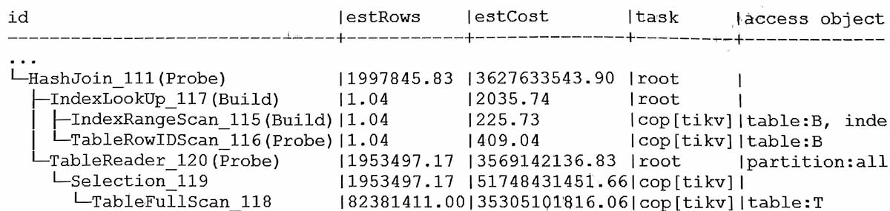
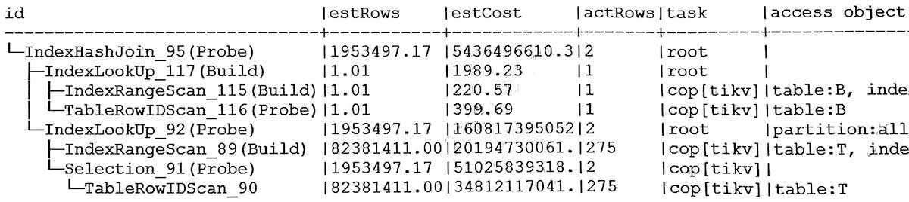

#

## 原执行计划
默认计划, T表全表扫描


指定使用 T.xid 索引


```sql
select b.*, t.*
from b, t
where b.id = 'xxx'
and b.xid = t.xid
and b.val = t.val
and ifnull(t.col1, 0) != 0
and t.col2 = '0' and t.col3 = '1' and ...
```

### 分析
T表根据xid关联条件过滤, 实际只有275条。  
由于B和T之间的表关联条件, 以及T表上有较多过滤条件, 不管HashJoin还是IndexJoin, 优化器对T表的结果条数估算都是错的。

另外, 由于bug-44855只会影响indexjoin的高估, 所以这里不是它的原因。

### 结论
优化器估算出错。

## 优化建议
对T表指定使用xid字段的索引。


