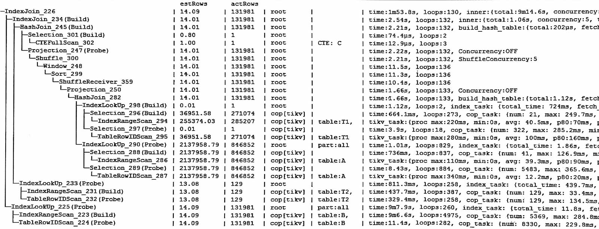

## 原执行计划

### 分析
B表有40个分区。  
IndexRangeScan_223的 loops:4975 rpc_num:5373, rpc_time:9m10s,  
虽然外表只有13万条, 不过 B表是全分区索引扫描, 用时还是比较高

A表有三个分区。  
sel_288, loops:837, rpc_num: 41, rpc_time:1.5s

sel_289, loops:884, rpc_num:5483, rpc_time:1m29s

### 结论

...待续

## 优化建议
...待续
