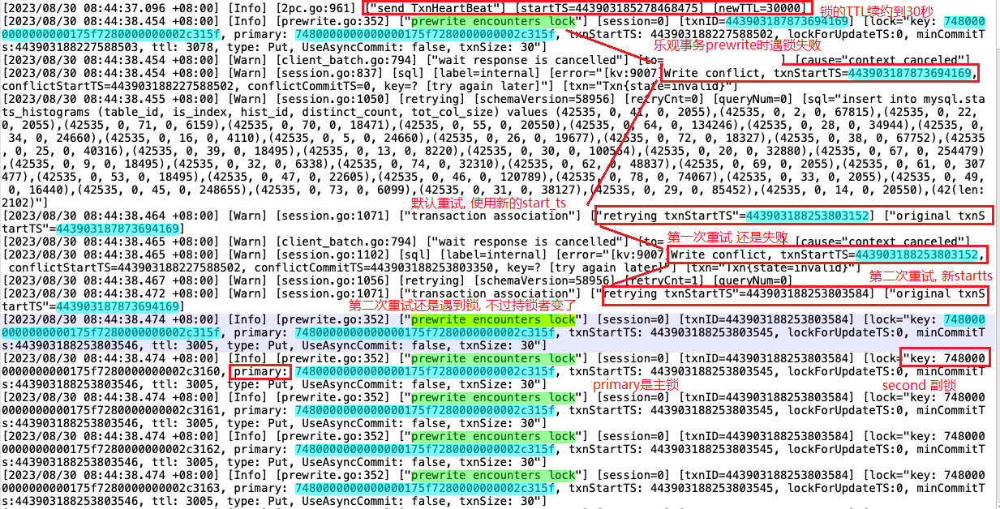
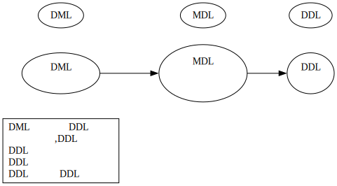

## 主锁 和 副锁
事务中数据行上的锁, 一般以0x74开头, 比如:  
7480000000000000175f7280000000002c315f  

一个日志中的例子

从图中可以看到
-   某个事务在续约锁的TTL生命期到30秒
-   某乐观事务在提交的prewrite阶段, 一直遇到锁, 重试了好几次
-   数据行锁分为主锁和副锁 (相关概念见官方文档)
-   乐观事务冲突严重时, 重试并不是一个好办法, 日志也暴涨

## meta锁
:::info
感觉这个meta锁, 与下面要说的MDL锁有一定的联系, 但目前可以容易地复现MDL锁, 但没法手工复现meta锁
:::  
meta锁一般是表级元数据信息的锁, 比如表上有auto_increment, 则insert数据时, 可能会对表的id分配器进行上锁之类操作。  
meta锁以0x64开头, 以区别于数据行的锁:  
6d44423a3737000000fc00000000000000685449443a31303237ff3431000000000000f9  

下面是v5版本的, 没有解释这个`original key`是什么  
[2023/08/30 08:04:45.893 +08:00] [Info] [prewrite.go:352] ["prewrite encounters lock"] [session=120017] [txnID=443902561061175523] [lock="key: 6d44423a3737000000fc00000000000000685449443a31303237ff3431000000000000f9, primary: 6d44423a3737000000fc00000000000000685449443a31303237ff3431000000000000f9, txnStartTS: 443902561061175502, lockForUpdateTS:0, minCommitTs:443902561061175503, ttl: 3001, type: Put, UseAsyncCommit: false, txnSize: 1"]  

[2023/08/30 08:04:45.947 +08:00] [Warn] [txn.go:83] [RunInNewTxn] ["retry txn"=443902561061175523] ["original txn"=443902561061175523] [error="[kv:9007]Write conflict, txnStartTS=443902561061175523, conflictStartTS=443902561061175502, conflictCommitTS=443902561061175589, key=? [try again later]"]

下面是v6版本的, 解释了`original key`  
INFO prewrite.go "prewrite encounter lock" session=7907 txn=449747566074789892 lock="key:6d44423a3132000000fc00000000000000685449443a39320000fe, primary:6d44423a3132000000fc00000000000000685449443a39320000fe, txnStart:449747566074789895, lockForUpdateTS:0, ttl:3001, type:Put, UseAsyncCommit:false, txnSize:1"  

WARN txn.go "retry txn"=449747566074789892, "original txn"=449747565983039530, error="[kv:9007]Write conflict, txnStart=449747566074789892, conflictStart=449747566074789895, key=[metaKey=true, key=DB:12, field=TID:92], originalKey=6d44423a3132000000fc00000000000000685449443a39320000fe, primary=[]byte(nil), originalPrimaryKey=, reason=Optimistic[try again later]"

上面 `originalKey`(0x6d44...) 就是`meta锁`, key的内容转译一下就是 **[metaKey=true, key=DB:12, field=TID:92]**

## MDL锁
从v6.x引入, 在v6.5上可以查看视图 mysql.tidb_mdl_view。  
事务中对表进行DML操作后, 就会产生MDL锁。  
表上有MDL锁, 则表的DDL操作会被阻塞, 可以查看视图来确认。

不过有时候在tidb_mdl_view中没有看到MDL锁, 也会出现DDL被阻塞的情况, 所以最直接的办法, 是看tidb日志中是否有写相关日志  

[2023/08/29 11:51:22.972 +08:00] [INFO] [session.go:4167] ["old running transaction block DDL"] ["table ID"=456108] [jobID=457620] ["connection ID"=2779998602610044105] ["elapsed time"=19h38m34.456775285s]  

类似的信息还有  
["[ddl] syncer check all versions, someone is not synced"]

上面看到一个ddl被某个事务阻塞了19小时, 那有两个可能:
-   gc life参数比19小时大, 可能是一天, 所以事务还没被强制取消;
-   或者这个事务是个僵死的会话, 可以尝试kill会话, 或者只能重启所在的tidb实例;

## 易混淆的

## 检索(主锁副锁)

used by local search

DML数据修改语句,
MDL表锁防止事务过程中表结构被修改,
DDL被阻塞,
DML语句会阻塞DDL,
频繁修改的表,DDL用时较长,
DDL不阻塞事务和查询,
DDL不锁表,
DDL只会阻塞DDL,

